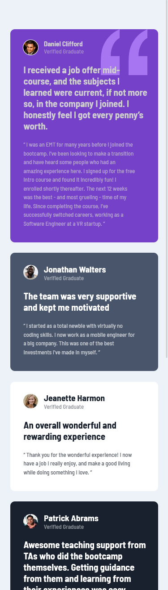
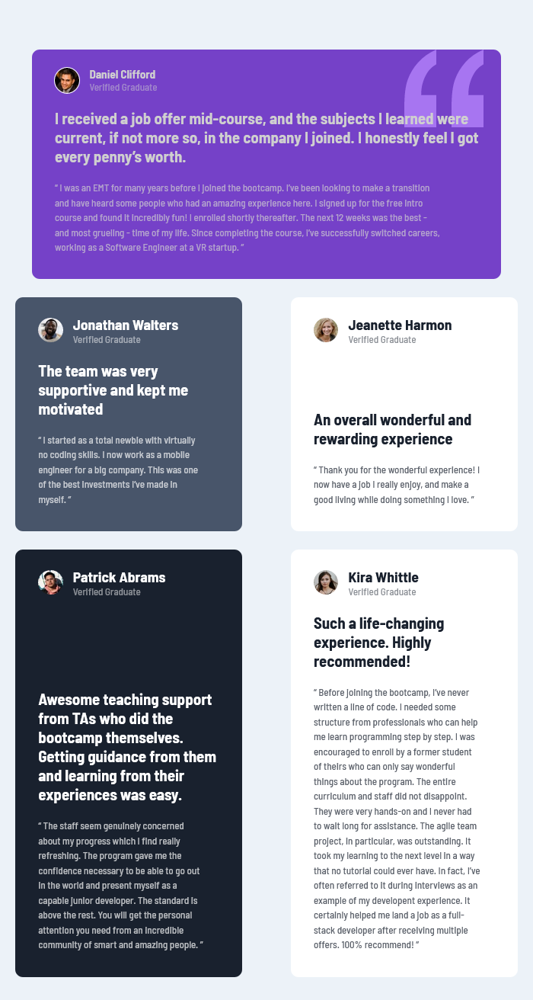
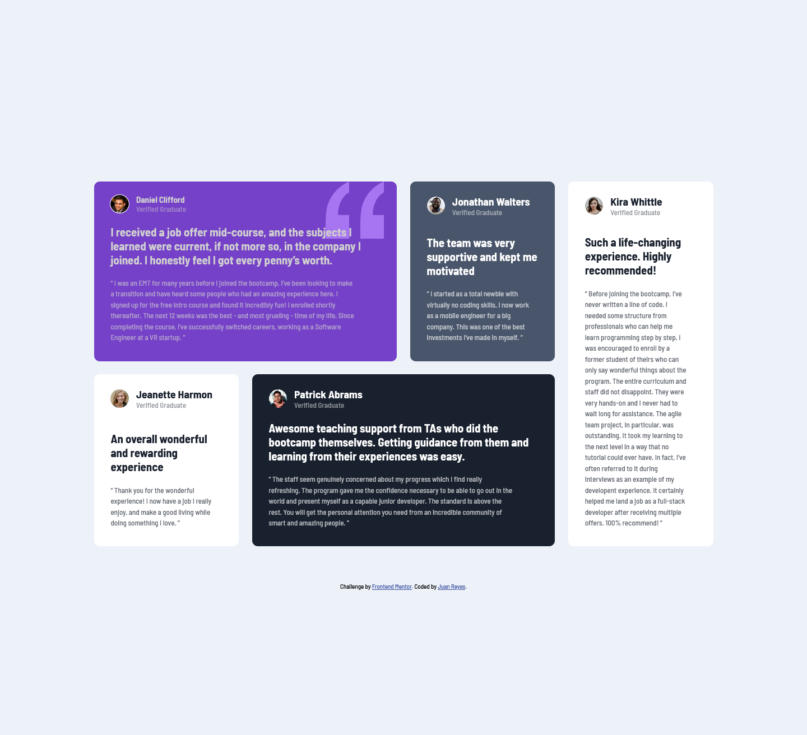

# Frontend Mentor - Testimonials grid section

## Deploying your project

As mentioned above, there are many ways to host your project for free. Our recommended hosts are:

- [GitHub Pages](https://pages.github.com/)
- [Vercel](https://vercel.com/)
- [Netlify](https://www.netlify.com/)

You can host your site using one of these solutions or any of our other trusted providers. [Read more about our recommended and trusted hosts](https://medium.com/frontend-mentor/frontend-mentor-trusted-hosting-providers-bf000dfebe).

## Got feedback for us?

We love receiving feedback! We're always looking to improve our challenges and our platform. So if you have anything you'd like to mention, please email hi[at]frontendmentor[dot]io.

This challenge is completely free. Please share it with anyone who will find it useful for practice.

## Table of contents

- [Overview](#overview)
  - [The challenge](#the-challenge)
  - [Screenshot](#screenshot)
  - [Links](#links)
- [My process](#my-process)
  - [Built with](#built-with)
  - [What I learned](#what-i-learned)
  - [Continued development](#continued-development)
- [Author](#author)
  

## Overview

- Se trata de 5 tarjetas testimoniales de perfiles
donde comparten experiencias sobre un curso de internet.

### The challenge
- En la de 375px sólo hay una columna.

- En este caso he utilizado una consulta de medios
intermedia, en la que la primera targeta ocupa dos 
columnas y el resto una columna cada una.

-Por último en la 1440px sigue un patrón muy divertido y visualmente atractivo.
    - La primera targeta ocupa dos columnas la segunda una y la última ocupa toda la columna.
    - En la segunda fila es lo mismo pero a la inversa.

### Screenshot

### Links

- Solution URL: [solución testimonials](https://github.com/juan-mentor/testimonials-grid-section-main.git)
- Live Site URL: [alojado en](juan-mentor.github.io/testimonials-grid-section-main/)

## My process

- En este caso he disfrutado más que en la solución anterior. Creo que aún no pienso como lo haría un desarrollador web.

-Este reto de nivel Junior ha sido desafiante y me he dado cuenta, que hasta ahora solo escribía propiedades Css, pero no sabía sacarles partido. Me he propuesto ahondar en ese tema y tengo algunas ideas para experimentar.

- Al interactuar con otras personas y mirar sus códigos, me está brindando la oprtunidad de abrir mi mente y ver las cosas desde otro punto de vista.

- En este proyecto he solucionado ciertos problemas, pero me han surgido nuevas dudas.

- He combinado Css grid con flexbox y veo que son 100% compatibles. Me imagino que conforme mis conocimientos de grid aumenten, podré utilizar menos flex.

### Built with

- Semantic HTML5 markup
- CSS custom properties
- Flexbox
- CSS Grid
- Mobile-first workflow

### What I learned

- He aprendido que flexbox y Css grid no son incompatibles, de hecho se hace muy cómodo trabajar con ambos.

- Estoy empezando a saber posicionar items con grid.

### Continued development

- Me gustaría aprender a crear grids de forma responsiva, sin necesidad de utilizar consultas de medios, o al menos depender menos de ellas.

- Quizás utilizar las opciones avanzadas que tiene Css grid, para no depender de como colocar el contenido y este se vea de forma uniforme, independientemente de lo largo o corto que sea.

### Useful resources

-  - Me ha ayudado a cambiar mi forma de pensar y distinguir entre justify items y content.

## Author

- Website - [Add your name here](https://www.your-site.com)
- Frontend Mentor - [@yourusername](https://www.frontendmentor.io/profile/yourusername)
